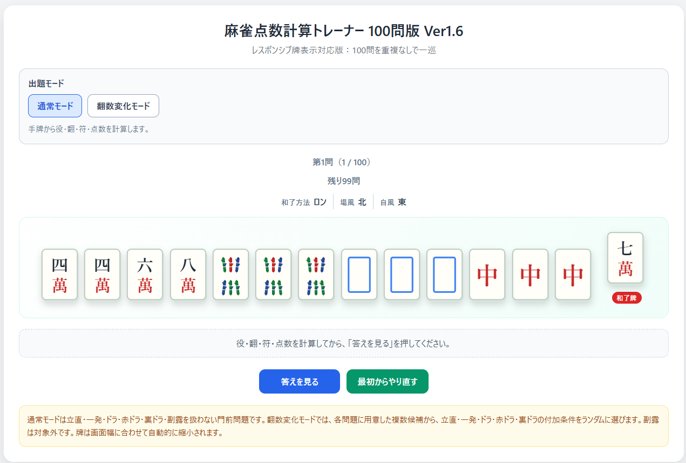
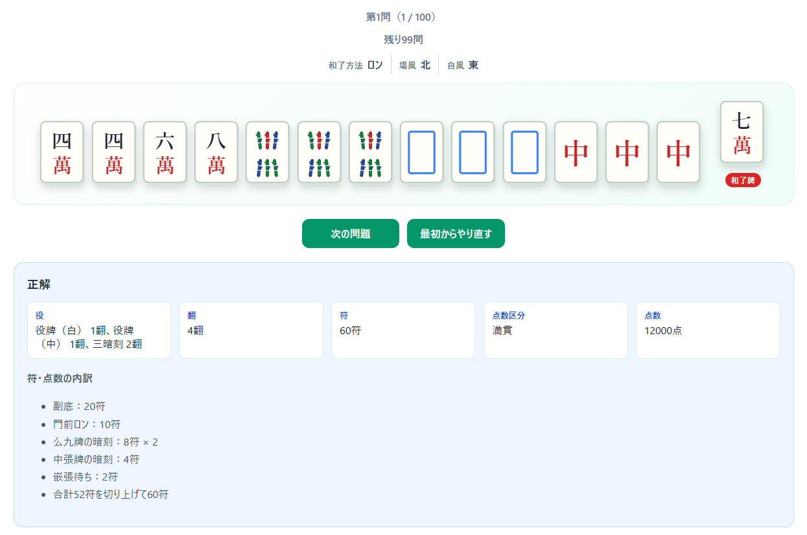
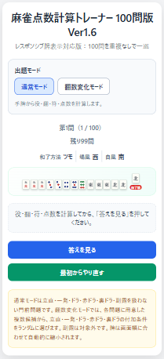

# 🀄 Mahjong Score Trainer

麻雀の点数計算を効率よく学習するためのWebアプリです。

符・翻・点数計算を繰り返し練習し、実戦で素早く正確に点数計算ができるようになることを目的としています。

**Version:** 1.6.0  
**Platform:** Web Browser (HTML / CSS / JavaScript)  
**Quality:** Playwright E2E + GitHub Actions CI

---

## 🌐 デモ

GitHub Pagesで公開しています。

https://doigoro-dev.github.io/mahjong-score-trainer/

---

# 📷 スクリーンショット

## トップ画面



---

## 解答表示画面



---

## スマートフォン表示



---

# ✨ 主な機能

- 全100問を収録
- 問題を重複なくランダム出題
- 通常モード
- 翻数変化モード
- 答え表示
- 最初からやり直し
- セッション保存（ブラウザをリロードしても途中から再開可能）
- PC・スマートフォン対応（レスポンシブデザイン）

---

# 🚀 起動方法

ビルド不要です。

```
app/index.html
```

をブラウザで開くだけで利用できます。

---

# 🧪 テスト

依存ライブラリをインストール

```bash
npm install
```

テスト実行

```bash
npm test
```

実行内容

- Static Data Check
- Playwright E2E Test

---

# 🔄 GitHub Actions

GitHub Actionsにより、Push・Pull Request時に自動で品質確認を実施しています。

実施内容

- Static Data Check
- Playwright E2E Test

問題データの破損や画面操作の不具合を自動で検知できます。

---

# 📁 ディレクトリ構成

```
.
├── app/                  アプリ本体
├── docs/
│   ├── images/           README用画像
│   └── user-manual.html
├── scripts/              静的データ検証
├── tests/
│   └── e2e/              Playwrightテスト
├── .github/
│   └── workflows/        GitHub Actions
├── package.json
└── README.md
```

---

# 📖 マニュアル

```
docs/user-manual.html
```

---

# 💻 開発環境

- HTML5
- CSS3
- JavaScript (Vanilla JavaScript)
- IndexedDB
- Node.js
- Playwright
- GitHub Actions

---

# ✅ 品質保証

Version 1.6では以下の品質確認を実施しています。

- 全100問の静的データ検証
- 重複IDチェック
- 符・翻数整合性チェック
- 切り上げ満貫問題チェック
- PlaywrightによるE2Eテスト
- GitHub ActionsによるCI

---

# 📦 Version

## Version 1.6.0

### 主な追加機能

- 翻数変化モード
- セッション保存
- レスポンシブ対応
- Playwright自動テスト
- GitHub Actions CI

---

# 🛣️ Roadmap

## Version 2（構想）

### 学習機能

- タイマー機能
- 自動採点機能
- 一気通貫・三色同順など新しい役の追加
- 牌のイラストを使った実戦形式の問題
- 苦手な問題を重点的に出題する機能

### 実戦モード

実戦での思考手順に近い流れで点数計算を練習できるモードを構想しています。

1. 聴牌時に立直するか選択する
2. この時点で打点を予想する
3. ツモまたはロンで和了する
4. 立直和了時は裏ドラ表示牌を公開する
5. 最終的な役・符・翻・点数を回答する
6. タイマー・自動採点・解説を表示する

### 将来の候補

- 外部麻雀アプリの手牌画像を読み取る機能（低優先度）

---

# 📄 License

本プロジェクトは個人学習・研究目的で開発しています。